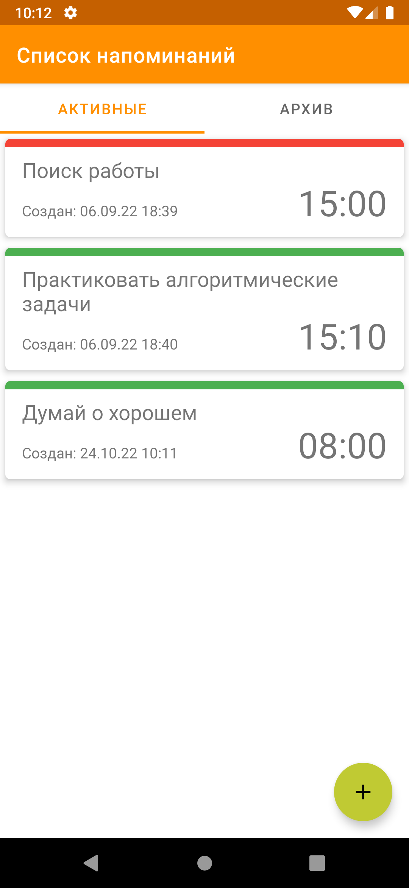

EvilFriend - Злой друг
===================================

Идея приложения
--------------
Приложение для напоминания о том, что необходимо сделать, но по каким-то причинам откладывается.
Приложение, как злой друг, без зазрений совести, но с скрытой заботой ежедневно будет напоминать о том, о чем Вы предпочитаете меньше вспоминать.

Приложение на стадии минимального жизнеспособного продукта.

Скриншоты
--------------
  

Функции и способы их реализации
--------------
Приложение содержит два экрана: список напоминаний и подробное представление, в котором отображаются параметры напоминания, которые можно редактировать.

#### Уровень  представления

Уровень представления состоит из следующих компонентов:
* Основное действие, которое обрабатывает навигацию.
* Фрагмент для отображения списка напоминаний.
* Фрагмент для отображения обзора напоминания.

Реализация навигации представлена `компонентом навигации Android Jetpack`, который обеспечивает согласованное и предсказуемое взаимодействие с пользователем.

Приложение использует архитектуру `Model-View-ViewModel` (MVVM) для уровня представления. Каждый из фрагментов соответствует представлению MVVM. View и `ViewModel` взаимодействуют с помощью `LiveData` и следующих принципов проектирования:

* Объекты ViewModel не имеют ссылок на действия, фрагменты или представления Android. Это может привести к утечке информации об изменениях конфигурации, таких как поворот экрана, поскольку система сохраняет ViewModel на протяжении всего жизненного цикла соответствующего представления.
* Объекты ViewModel предоставляют данные с помощью LiveData объектов. LiveData позволяет вам наблюдать за изменениями данных в нескольких компонентах вашего приложения без создания явных и жестких путей зависимости между ними.

Отображение списка напоминаний с помощью библиотеки `RecyclerView` динамически создает элементы, когда они необходимы. Во фрагменте списка включена `View Binding`. Реализован `TabLayout` для фильтрации списка напоминаний, можно отдельно посмотреть напоминания, которые перемещены в архив.

При нажатии на элемент списка открывается интерфейс отображения выбранного напоминания. Также есть кнопка `FAB` для создания нового напоминания.

Для отображения формы напоминания используется `Data Binding Library`, которая позволяет привязывать компоненты пользовательского интерфейса в макетах к источникам данных, используя декларативный формат.
В форме отдельного напоминания можно указать/изменить данные напоминания, переместить в архив, изменить время напоминания.

#### Уровень данных 

База данных создается с помощью `Room` и имеет две сущности: `Prompt` и `Notification`, которые генерируют соответствующие таблицы SQLite во время выполнения на основе моделей и миграций.

Для доступа к данным и выполнения запросов используются объекты доступа к данным (DAO).  Запросы, возвращающие `Flow` объект, можно наблюдать, поэтому при обнаружении изменения в одной из затронутых таблиц Flow доставляется уведомление об этом изменении зарегистрированным наблюдателям.

#### Внедрение зависимостей

Для управления зависимостями используется `Dagger2` (пакет di).

#### Отправка уведомлений

При сохранении напоминания устанавливается повторяющийся будильник с помощью  `AlarmManager`, который передает `PendingIntent` с данными уведомления.
В PendingIntent передается Intent `BroadcastReceiver`, который в установленное время отсылает уведомление приложения с текстом напоминания.

Идеи для расширения
--------------
* Настройка уведомлений в зависимости от уровня напоминания
* Указание дней показа напоминаний
* Добавить мотивационные/упрекающие фразы при показе напоминаний для усиления эффекта
